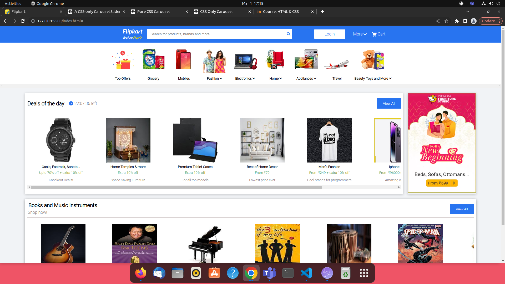
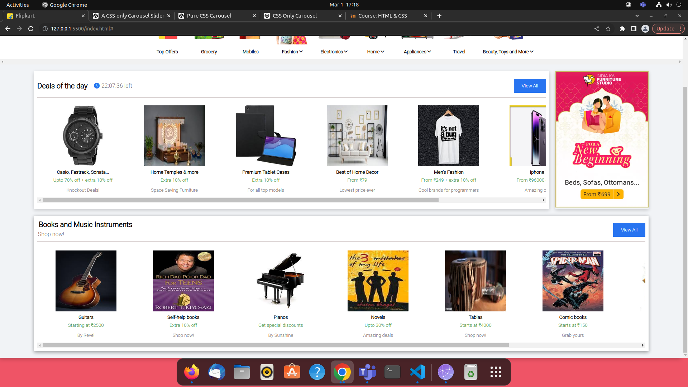
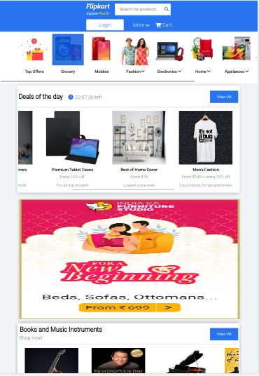
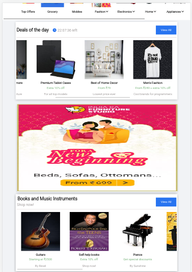
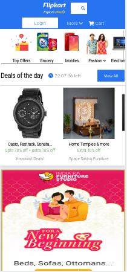
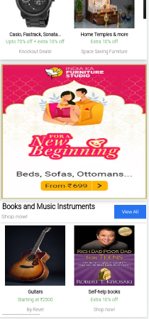

# Flipkart Clone

- This project is a clone of the e-commerce website - "Flipkart".
- The project is built only using pure HTML and CSS.

********

## HTML concepts and tools used in the project
- section : There are 4 sections in the code to specify a specific content i.e navbar, categories, deals and ad, other deals.
- link : to link documents in our index page.
- div : To form partitions for the ease of development and styling the components.
- google fonts : To ensure that the font works the same on all browsers.
- favicon : To add icons
- fontawesome : To add small icons.
- dropdown : To show a list of items from dropdown menu.

**Major Tags used:**
- `section`
- `img`
- `p`
- `div`
- `i`
- `button`
- `span`
- `a`

*********

## CSS concepts and properties used in the project
- CSS Selectors
- Backgrounds and Borders
- Margins and Padding
- Sizing
- CSS Layout 
- Combinators
- Pseudo-class and Pseudo-element
- CSS Attr Selectors
- CSS Forms
- CSS Box Sizing
- Shadows
- CSS Media Queries
- CSS Flex-box

*********

## Screenshots

**Desktop view:**

 \

 \

**Ipad Air view:**

 \

 \

**Iphone XR view:**

 \

 \

